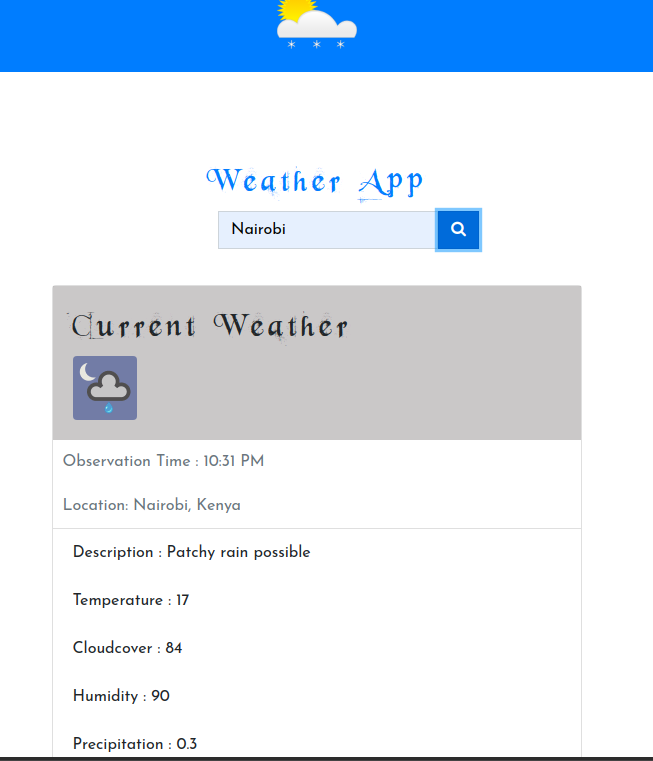

# Weather App

This is a weather app that takes in the city of choice as the request and shows the current weather of the input.




This app is coded in **ReactJs**.
To run the app, just pull the code and `cd` in to the weather directory.


```
 cd weather

```

Run the app: 


```
 npm start

```

to run on the development server.

To build the app, run:

```
npm build

```

## Info

The app is build on to the **WeatherStack** api with limited API calls.

An API key is required to run the app.

The key is to be stored in a `.env` file together with the base url of the API for safety reasons.


